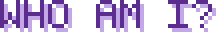
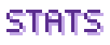
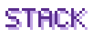
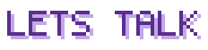

  <picture>
    <source media="(prefers-color-scheme: dark)" srcset="assets/h-pet.svg" />
    
  </picture>

  

  
  
  

  

<picture>
  <source media="(prefers-color-scheme: dark)" srcset="assets/h-whoami.svg" />
  
</picture>

**gw gak ngoding. gw cuma cerewet ke AI sampe dia nyerah.** 🫠

no CS degree, no bootcamp, no idea what i'm doing. tapi jalan sih, entah gimana caranya.

stack gw literally cuma: `bahasa Indonesia` → `AI` → `software yang beneran jalan`. ternyata bagian susahnya bukan syntax, tapi ngejelasin maunya apa — dan itu satu-satunya skill yang gw punya, murni hasil kebanyakan protes.

yang gw bikin? apa aja yang bikin gw males ngerjain manual. automation biar gak ngulang kerjaan yang sama 100 kali, tooling spreadsheet buat hal yang Google sendiri gak niatin, sama tools receh yang cuma gw doang yang buka. bukan portfolio, bukan ngejar apa-apa — beneran iseng sela-sela kerja doang.

**buka buat kolab** kalau ada yang kepake. gaskeun 🤝

 

<b>🇬🇧 english version (biar keliatan niat)</b>

 

**i don't write code. i just yap at the AI until it gives up.** 🫠

no CS degree, no bootcamp, genuinely no clue what i'm doing. ships anyway. somehow.

my stack is literally `talking in Indonesian` → `AI` → `deployed`. turns out the hard part was never syntax — it's explaining what you actually want, which i'm only good at because i complain a lot.

what i build: whatever i was too lazy to keep doing by hand. automations so i stop repeating the same task 100 times, spreadsheet tooling for things Google never intended, and tiny tools nobody but me will ever open. not a portfolio, not chasing anything — genuinely just messing around between shifts.

**open to collab** if any of it is useful. hmu 🤝

  

<picture>
  <source media="(prefers-color-scheme: dark)" srcset="assets/h-stats.svg" />
  
</picture>

  
  

  

<picture>
  <source media="(prefers-color-scheme: dark)" srcset="assets/h-stack.svg" />
  
</picture>

  

  <picture>
    <source media="(prefers-color-scheme: dark)" srcset="assets/h-noskills.svg" />
    
  </picture>

  

<picture>
  <source media="(prefers-color-scheme: dark)" srcset="assets/h-collab.svg" />
  
</picture>

kalau ada yang kepake, sikat aja DM-nya. gw paling seneng ngobrol sama orang yang juga bikin sesuatu tanpa background dev — ternyata kita rame, cuma pada gengsi ngaku.

  ⚡ bahasa pemrograman yang paling sering gw pake: bahasa Indonesia

<!-- ═══════════════════════════════════════════════════════════════
  PARKED — re-enable once the GitHub Actions have run at least once,
  otherwise these render as broken images.

  🐍 SNAKE (needs .github/workflows/snake.yml + one run on the Actions tab)
  

  🏙️ 3D GRAPH (needs .github/workflows/profile-3d.yml + one run)
  

  📈 ACTIVITY GRAPH / 🔥 STREAK — third-party hosts, frequently down
  
  

  🤖 EARLIER ROBOT THEME — assets/runner.svg + assets/emblem.svg are still in the repo
  
═══════════════════════════════════════════════════════════════ -->
