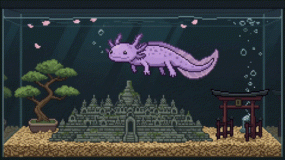
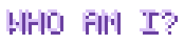
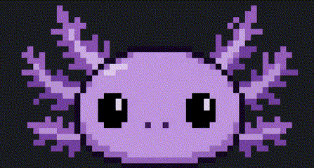
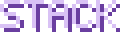
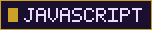
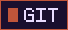
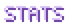
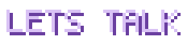

  

  
  
  

  

**I don't write code. I describe problems — the AI does the typing.**

No CS degree, no bootcamp, no formal training. Everything here gets built between work hours, because doing the same thing manually for the hundredth time finally got old.

My stack is basically `plain Indonesian` → `AI` → `working software`. Turns out the hard part was never the syntax — it's knowing the problem well enough to explain it properly.

I build what I personally need: automations that kill repetitive work, spreadsheet tooling that does what spreadsheets were never meant to do, and small utilities nobody would ever ship as a product. Side project energy, not portfolio grind.

**Open to collab** if any of this is useful to you.

 

<b>🇮🇩 Baca versi Bahasa Indonesia</b>

 

**Aku nggak nulis kode. Aku jelasin masalahnya — AI yang ngetik.**

Nggak kuliah IT, nggak pernah bootcamp, nggak ada training formal. Semua ini dibikin di sela jam kerja, karena capek juga ngerjain hal yang sama manual terus.

Stack-ku pada dasarnya `bahasa Indonesia` → `AI` → `software yang jalan`. Ternyata bagian susahnya bukan syntax — tapi paham masalahnya cukup dalam sampai bisa dijelasin dengan benar.

Aku bikin apa yang aku butuhin sendiri: automation buat kerjaan repetitif, tooling spreadsheet buat hal yang spreadsheet nggak dirancang buat itu, dan utilities kecil yang nggak bakal ada yang jual. Energi project iseng, bukan ngejar portfolio.

**Terbuka buat kolaborasi** kalau ada yang kepake buat kamu.

  

  
  
  
  
  
  
  
  

  

  
  

  

If something here is useful to you, hit me up. Especially interested in talking to people who are also building without a traditional dev background — there are more of us than you'd think.

  ⚡ my most-used programming language is plain Indonesian

<!-- ═══════════════════════════════════════════════════════════════
  PARKED — re-enable once the GitHub Actions have run at least once,
  otherwise these render as broken images.

  🐍 SNAKE (needs .github/workflows/snake.yml + one run on the Actions tab)
  

  🏙️ 3D GRAPH (needs .github/workflows/profile-3d.yml + one run)
  

  📈 ACTIVITY GRAPH / 🔥 STREAK — third-party hosts, frequently down
  
  

  🤖 EARLIER ROBOT THEME — assets/runner.svg + assets/emblem.svg are still in the repo
  
═══════════════════════════════════════════════════════════════ -->
